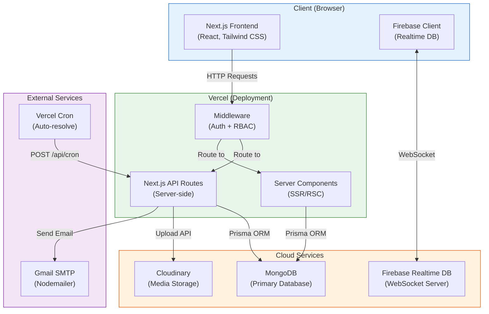
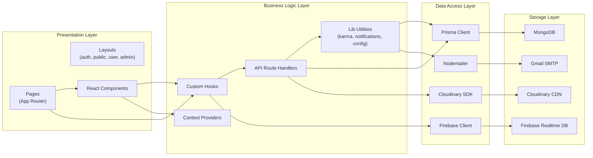
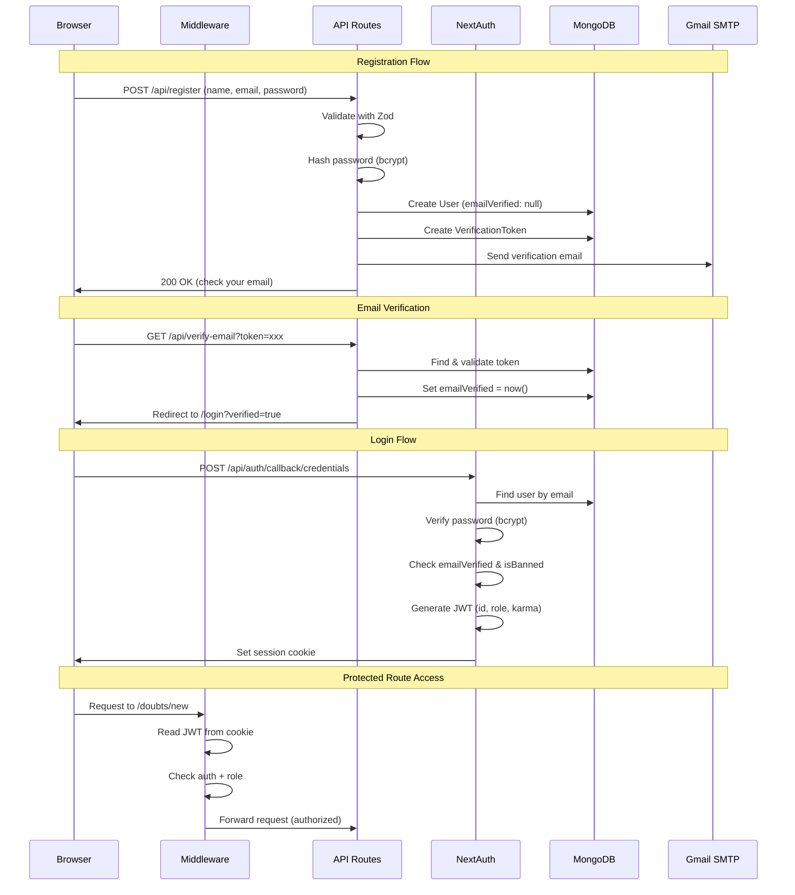
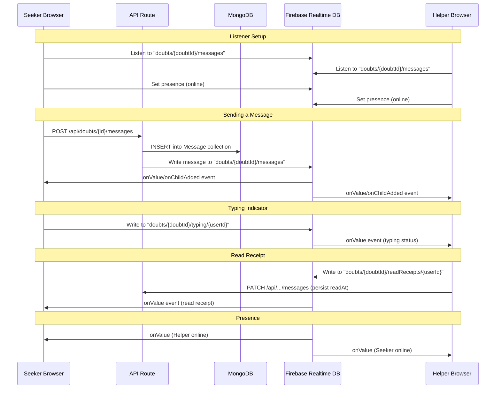
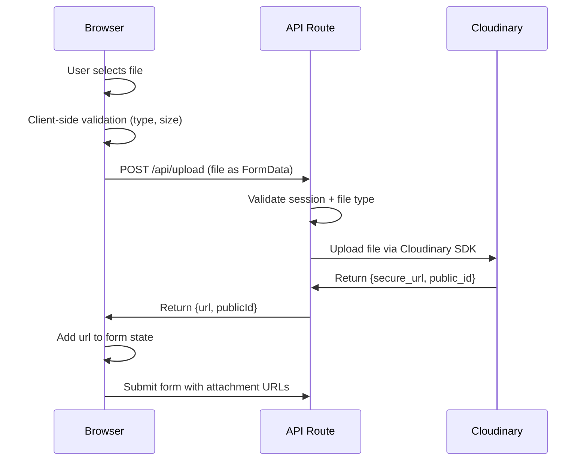
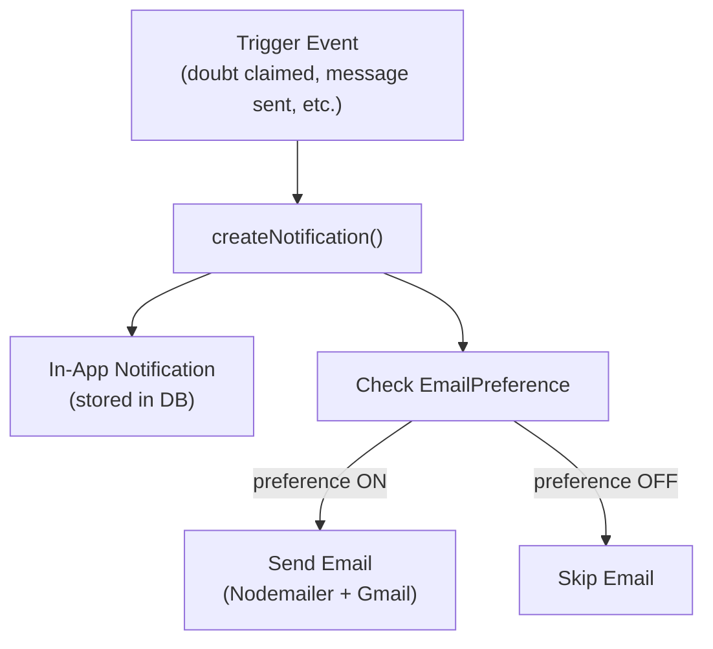
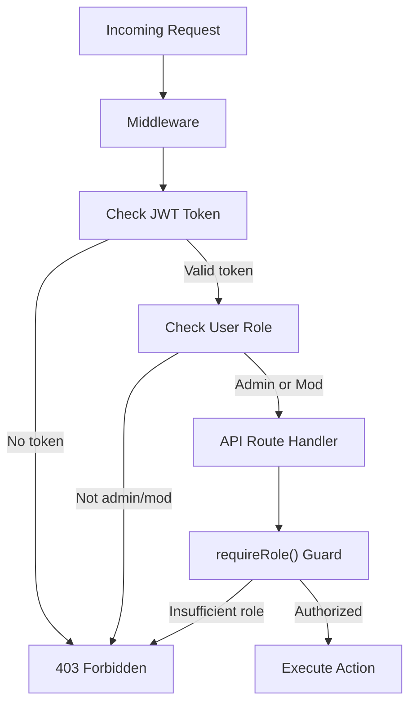
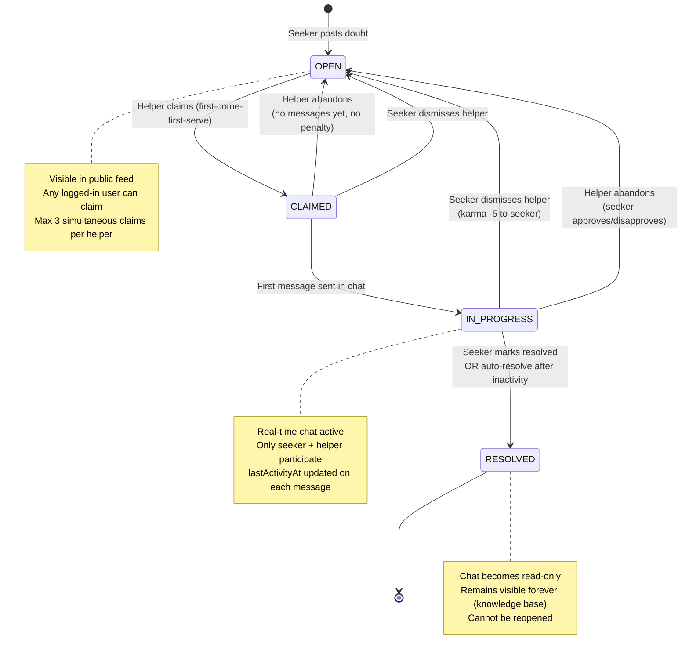
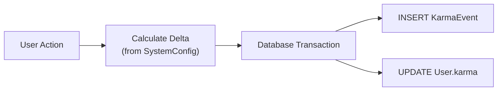
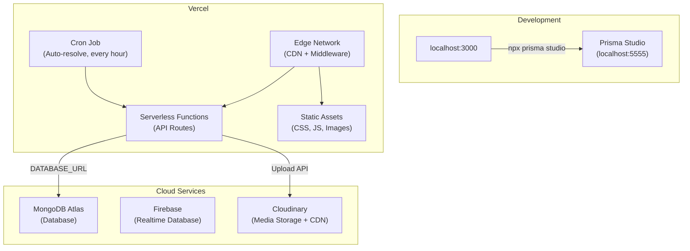

# System Architecture

## Peer Connect - Architecture Document

---

## 1. High-Level System Architecture



---

## 2. Tech Stack

| Layer | Technology | Purpose |
|-------|-----------|---------|
| **Frontend** | Next.js 14+ (App Router) | UI rendering, routing, server components |
| **Language** | TypeScript | Type safety across frontend and backend |
| **Styling** | Tailwind CSS + next-themes | Utility-first CSS, light/dark theme |
| **Auth** | NextAuth.js (v4) | Session management, JWT, credentials provider |
| **ORM** | Prisma | Type-safe database access |
| **Database** | MongoDB (via Prisma) | Primary data store |
| **Real-time** | Firebase Realtime Database | Live chat, typing indicators, presence |
| **Storage** | Cloudinary | File/image uploads (doubt attachments, chat files, avatars) |
| **Email** | Nodemailer + Gmail SMTP | Verification, notifications, announcements |
| **State** | React useState/useContext | Client-side state (no external library) |
| **Validation** | Zod | Schema validation for API inputs |
| **Deployment** | Vercel | Hosting, serverless functions, cron jobs |

---

## 3. Application Layer Architecture



---

## 4. Authentication Architecture



### Auth Configuration

- **Strategy**: JWT (stateless, Vercel edge-compatible)
- **Session duration**: 30 days
- **JWT payload**: `{ id, email, name, role, karma, image }`
- **Provider**: CredentialsProvider (email + password)
- **Password hashing**: bcrypt (12 rounds)
- **Token generation**: `crypto.randomUUID()`

### Middleware Route Protection

| Route Group | Access Rule |
|-------------|------------|
| `(auth)/*` (login, register, etc.) | If already authenticated → redirect to `/` |
| `(public)/*` (feed, doubt detail, etc.) | Open to all |
| `(user)/*` (post doubt, bookmarks, etc.) | Must be authenticated → else redirect to `/login` |
| `(admin)/*` (dashboard, config, etc.) | Must be ADMIN or MODERATOR → else redirect to `/` |

---

## 5. Real-time Chat Architecture



### Firebase Realtime DB Structure

Each active doubt chat uses a path: `doubts/{doubtId}/`

| Feature | Mechanism | Persisted? |
|---------|-----------|-----------|
| New messages | Firebase listener on `doubts/{doubtId}/messages` (onChildAdded) | Yes (MongoDB + Firebase) |
| Edited messages | Firebase listener on `doubts/{doubtId}/messages` (onChildChanged) | Yes (MongoDB + Firebase) |
| Typing indicators | Firebase write to `doubts/{doubtId}/typing/{userId}` | No (ephemeral, auto-cleared) |
| Read receipts | Firebase write to `doubts/{doubtId}/readReceipts/{userId}` + API call | Partially |
| Online/offline status | Firebase Presence (`onDisconnect` + connection listener) | No (ephemeral) |

---

## 6. File Upload Architecture



### Cloudinary Folders

| Folder | Purpose | Max Size | Access |
|--------|---------|----------|--------|
| `p2p/doubt-attachments` | Files on doubt descriptions | 25 MB | Public read |
| `p2p/chat-attachments` | Files/images in chat | 25 MB | Public read (URL-based) |
| `p2p/avatars` | User profile pictures | 2 MB | Public read |

### Allowed File Types

- **Images**: jpeg, png, gif, webp
- **Documents**: pdf, txt
- **Archives**: zip (doubt-attachments only)

---

## 7. Notification System Architecture



### Notification Delivery

| Channel | Mechanism | Latency |
|---------|-----------|---------|
| In-app | Fetched on page load + 60s polling | Near real-time |
| Email | Nodemailer via Gmail SMTP | 1-5 seconds |

### Notification Triggers

| Event | Recipient | Type |
|-------|-----------|------|
| Doubt claimed | Seeker | DOUBT_CLAIMED |
| New message | Other party | NEW_MESSAGE |
| Doubt resolved | Helper | DOUBT_RESOLVED |
| New doubt in followed tag | Tag followers | TAG_NEW_DOUBT |
| Announcement created | All users | ANNOUNCEMENT |
| Report resolved | Reporter | REPORT_UPDATE |
| Karma change | User | KARMA_CHANGE |

---

## 8. Admin RBAC Architecture



### Permission Matrix

| Action | USER | MODERATOR | ADMIN |
|--------|:----:|:---------:|:-----:|
| View admin dashboard | - | Y | Y |
| View user list | - | Y | Y |
| Ban/unban users | - | - | Y |
| Change user roles | - | - | Y |
| Adjust karma manually | - | - | Y |
| View & resolve reports | - | Y | Y |
| Delete/moderate doubts | - | Y | Y |
| Approve/reject tags | - | Y | Y |
| Create announcements | - | - | Y |
| View analytics | - | Basic | Full |
| System configuration | - | - | Y |

---

## 9. Doubt Lifecycle State Machine



---

## 10. Karma System

### Karma Event Flow



### Karma Weight Table

| Action | Delta | Notes |
|--------|------:|-------|
| Doubt resolved (helper) | +15 | Main incentive |
| Doubt resolved (seeker) | +5 | Encourages posting |
| Received upvote (doubt or message) | +2 | - |
| Received downvote (doubt or message) | -1 | - |
| Dismissed by seeker | -5 | Applied to seeker (anti-abuse) |
| Abandoned (disapproved by seeker) | -10 | Applied to helper |
| Tag approved (suggester) | +3 | - |
| First doubt posted | +1 | One-time bonus |

All values are admin-configurable via SystemConfig table.

---

## 11. Project Folder Structure

```
p2p/
├── prisma/
│   ├── schema.prisma              # 26 collections, 9 enums
│   └── seed.ts                    # Default config, categories, admin user
├── docs/
│   ├── srs.md                     # Software Requirements Specification
│   ├── er-diagram.md              # Entity-Relationship Diagram
│   ├── architecture.md            # This document
│   ├── use-case.md                # Use Case Diagrams
│   ├── dfd.md                     # Data Flow Diagrams
│   └── api-reference.md           # API Endpoint Reference
├── public/
├── src/
│   ├── app/
│   │   ├── layout.tsx             # Root layout (providers)
│   │   ├── globals.css            # Tailwind + CSS variables
│   │   ├── (auth)/                # Login, register, verify, reset
│   │   ├── (public)/              # Feed, doubt detail, profiles, tags, leaderboard
│   │   ├── (user)/                # Post doubt, bookmarks, activity, settings
│   │   ├── (admin)/admin/         # Dashboard, users, reports, tags, config
│   │   └── api/                   # All API route handlers
│   ├── components/
│   │   ├── ui/                    # Reusable UI primitives
│   │   ├── layout/                # Navbar, Footer, Sidebar
│   │   ├── auth/                  # Auth forms
│   │   ├── doubts/                # Doubt components
│   │   ├── chat/                  # Chat components
│   │   ├── profile/               # Profile components
│   │   ├── activity/              # Dashboard components
│   │   ├── leaderboard/           # Leaderboard components
│   │   └── admin/                 # Admin components
│   ├── hooks/                     # Custom React hooks
│   ├── lib/                       # Utility functions, clients, helpers
│   ├── providers/                 # React context providers
│   ├── types/                     # TypeScript definitions
│   └── middleware.ts              # Route protection
├── .env.local                     # Environment variables (MongoDB, Firebase, Cloudinary, etc.)
├── next.config.ts
├── tailwind.config.ts
├── tsconfig.json
└── package.json
```

---

## 12. Deployment Architecture



### Environment Variables

| Variable | Purpose |
|----------|---------|
| `DATABASE_URL` | MongoDB connection string (MongoDB Atlas) |
| `NEXTAUTH_SECRET` | NextAuth JWT signing secret |
| `NEXTAUTH_URL` | Application base URL |
| `NEXT_PUBLIC_FIREBASE_API_KEY` | Firebase API key (client-side) |
| `NEXT_PUBLIC_FIREBASE_AUTH_DOMAIN` | Firebase auth domain (client-side) |
| `NEXT_PUBLIC_FIREBASE_PROJECT_ID` | Firebase project ID (client-side) |
| `NEXT_PUBLIC_FIREBASE_DATABASE_URL` | Firebase Realtime Database URL (client-side) |
| `FIREBASE_SERVICE_ACCOUNT_KEY` | Firebase Admin SDK service account JSON (server-side) |
| `CLOUDINARY_CLOUD_NAME` | Cloudinary cloud name |
| `CLOUDINARY_API_KEY` | Cloudinary API key |
| `CLOUDINARY_API_SECRET` | Cloudinary API secret |
| `GMAIL_USER` | Gmail address for sending emails |
| `GMAIL_APP_PASSWORD` | Gmail app password |
| `CRON_SECRET` | Secret for authenticating cron job requests |
