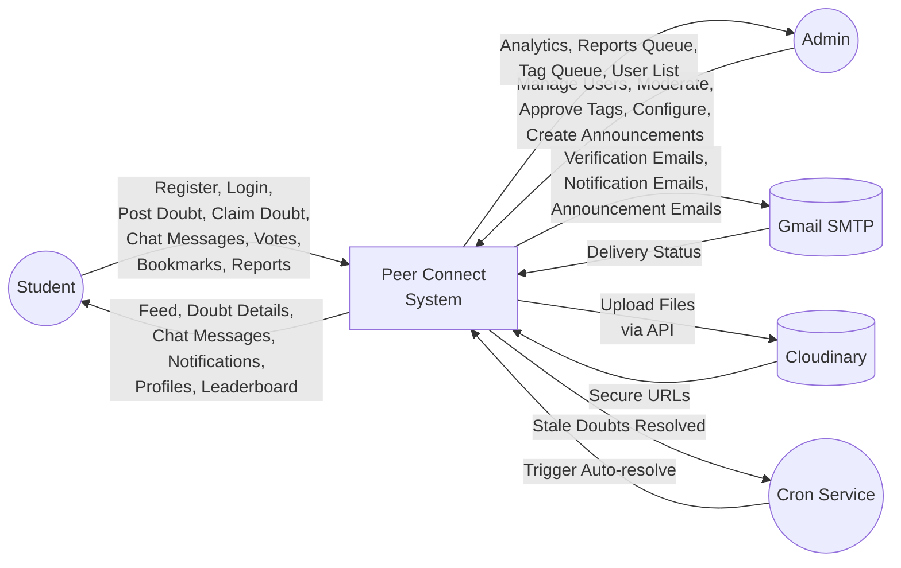
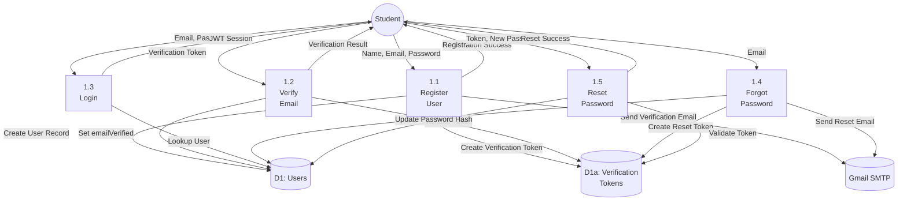
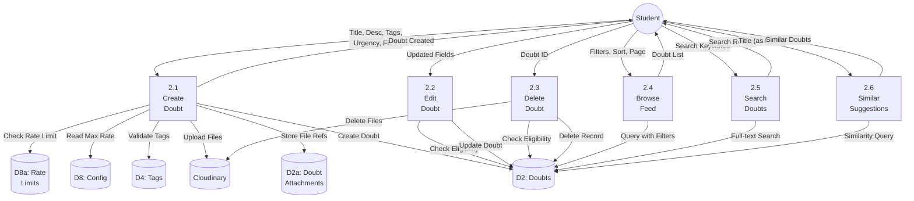
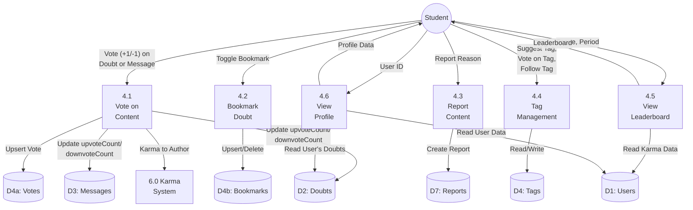
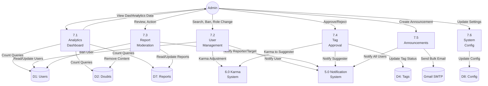

# Data Flow Diagrams

## Peer Connect - DFD Document

---

## 1. Context Diagram (Level 0 DFD)

The context diagram shows the system as a single process with external entities.

---

## 2. Level 1 DFD - System Decomposition

The system is decomposed into 8 major processes.

```mermaid
graph TB
    %% External Entities
    Student((Student))
    Admin((Admin))
    Gmail[(Gmail SMTP)]
    Storage[(Cloudinary)]
    Cron((Cron))

    %% Data Stores
    DB_Users[(D1: Users)]
    DB_Doubts[(D2: Doubts)]
    DB_Messages[(D3: Messages)]
    DB_Tags[(D4: Tags &<br/>Categories)]
    DB_Notif[(D5: Notifications)]
    DB_Karma[(D6: Karma<br/>Events)]
    DB_Reports[(D7: Reports)]
    DB_Config[(D8: System<br/>Config)]

    %% Processes
    P1["1.0<br/>Authentication<br/>System"]
    P2["2.0<br/>Doubt<br/>Management"]
    P3["3.0<br/>Help Lifecycle<br/>& Chat"]
    P4["4.0<br/>Social<br/>Features"]
    P5["5.0<br/>Notification<br/>System"]
    P6["6.0<br/>Karma<br/>System"]
    P7["7.0<br/>Admin<br/>Panel"]
    P8["8.0<br/>Auto-resolve<br/>Service"]

    %% Authentication flows
    Student -->|"Credentials"| P1
    P1 -->|"Session/JWT"| Student
    P1 -->|"Read/Write User"| DB_Users
    P1 -->|"Send Verification"| Gmail

    %% Doubt Management flows
    Student -->|"Doubt Data,<br/>Files"| P2
    P2 -->|"Feed, Search Results,<br/>Doubt Details"| Student
    P2 -->|"Read/Write"| DB_Doubts
    P2 -->|"Read Categories"| DB_Tags
    P2 -->|"Upload Files"| Storage
    P2 -->|"Check Rate"| DB_Config

    %% Help Lifecycle & Chat flows
    Student -->|"Claim, Chat Messages,<br/>Resolve, Dismiss, Abandon"| P3
    P3 -->|"Chat Stream,<br/>Status Updates"| Student
    P3 -->|"Read/Write"| DB_Doubts
    P3 -->|"Read/Write"| DB_Messages
    P3 -->|"Trigger Karma"| P6
    P3 -->|"Trigger Notification"| P5

    %% Social Features flows
    Student -->|"Votes, Bookmarks,<br/>Reports, Tag Suggestions"| P4
    P4 -->|"Vote Counts, Bookmarks,<br/>Leaderboard, Profiles"| Student
    P4 -->|"Read/Write"| DB_Doubts
    P4 -->|"Read/Write"| DB_Tags
    P4 -->|"Write"| DB_Reports
    P4 -->|"Trigger Karma"| P6
    P4 -->|"Read"| DB_Users

    %% Notification System flows
    P5 -->|"In-App Notifications"| Student
    P5 -->|"Read/Write"| DB_Notif
    P5 -->|"Check Preferences"| DB_Users
    P5 -->|"Send Email"| Gmail

    %% Karma System flows
    P6 -->|"Read/Write"| DB_Karma
    P6 -->|"Update User Karma"| DB_Users
    P6 -->|"Read Config"| DB_Config

    %% Admin Panel flows
    Admin -->|"Management Actions"| P7
    P7 -->|"Analytics, Queues"| Admin
    P7 -->|"Read/Write"| DB_Users
    P7 -->|"Read/Write"| DB_Doubts
    P7 -->|"Read/Write"| DB_Reports
    P7 -->|"Read/Write"| DB_Tags
    P7 -->|"Read/Write"| DB_Config
    P7 -->|"Trigger Notification"| P5
    P7 -->|"Send Announcement"| Gmail

    %% Auto-resolve flows
    Cron -->|"Trigger"| P8
    P8 -->|"Read Config"| DB_Config
    P8 -->|"Read/Update Stale"| DB_Doubts
    P8 -->|"Trigger Notification"| P5
    P8 -->|"Trigger Karma"| P6
```

---

## 3. Level 2 DFDs - Process Decomposition

### 3.1 Process 1.0 - Authentication System

### 3.2 Process 2.0 - Doubt Management

### 3.3 Process 3.0 - Help Lifecycle & Chat

```mermaid
graph TB
    Student((Student))
    DB_Doubts[(D2: Doubts)]
    DB_Messages[(D3: Messages)]
    DB_Dismiss[(D3a: Helper<br/>Dismissals)]
    DB_Abandon[(D3b: Abandon<br/>Requests)]
    KarmaSystem["6.0 Karma<br/>System"]
    NotifSystem["5.0 Notification<br/>System"]
    Storage[(Cloudinary)]
    Realtime["Firebase<br/>Realtime DB"]

    P3_1["3.1<br/>Claim<br/>Doubt"]
    P3_2["3.2<br/>Send<br/>Message"]
    P3_3["3.3<br/>Resolve<br/>Doubt"]
    P3_4["3.4<br/>Dismiss<br/>Helper"]
    P3_5["3.5<br/>Abandon<br/>Doubt"]
    P3_6["3.6<br/>Review<br/>Abandon"]

    Student -->|"Doubt ID"| P3_1
    P3_1 -->|"Check: status OPEN,<br/>claim count < 3"| DB_Doubts
    P3_1 -->|"Set helper, status=CLAIMED"| DB_Doubts
    P3_1 -->|"Notify Seeker"| NotifSystem
    P3_1 -->|"Claim Confirmed"| Student

    Student -->|"Message Content,<br/>Attachments"| P3_2
    P3_2 -->|"Store Message"| DB_Messages
    P3_2 -->|"Upload Attachments"| Storage
    P3_2 -->|"If 1st msg: status=IN_PROGRESS"| DB_Doubts
    P3_2 -->|"Update lastActivityAt"| DB_Doubts
    P3_2 -->|"Broadcast Message"| Realtime
    P3_2 -->|"Notify Other Party"| NotifSystem

    Student -->|"Mark Resolved"| P3_3
    P3_3 -->|"Set status=RESOLVED"| DB_Doubts
    P3_3 -->|"Award Helper Karma"| KarmaSystem
    P3_3 -->|"Award Seeker Karma"| KarmaSystem
    P3_3 -->|"Notify Helper"| NotifSystem

    Student -->|"Dismiss Reason"| P3_4
    P3_4 -->|"Record Dismissal"| DB_Dismiss
    P3_4 -->|"Set status=OPEN, clear helper"| DB_Doubts
    P3_4 -->|"Penalty to Seeker"| KarmaSystem
    P3_4 -->|"Notify Helper"| NotifSystem

    Student -->|"Abandon Reason"| P3_5
    P3_5 -->|"Create AbandonRequest"| DB_Abandon
    P3_5 -->|"Notify Seeker"| NotifSystem

    Student -->|"Approve/Disapprove"| P3_6
    P3_6 -->|"Update AbandonRequest"| DB_Abandon
    P3_6 -->|"Set status=OPEN, clear helper"| DB_Doubts
    P3_6 -->|"If disapproved: penalty"| KarmaSystem
    P3_6 -->|"Notify Helper"| NotifSystem
```

### 3.4 Process 4.0 - Social Features

### 3.5 Process 7.0 - Admin Panel

---

## 4. Data Store Dictionary

| ID | Name | Description | Key Tables |
|----|------|-------------|------------|
| D1 | Users | User accounts, profiles, auth data | User, Account, Session, VerificationToken, EmailPreference |
| D2 | Doubts | Academic queries and attachments | Doubt, DoubtAttachment, DoubtTag |
| D3 | Messages | Chat messages and attachments | Message, MessageAttachment, MessageReadReceipt |
| D4 | Tags & Categories | Taxonomy and follow relationships | Category, Tag, TagVote, UserCategory, UserTag |
| D5 | Notifications | In-app notification records | Notification |
| D6 | Karma Events | Karma audit trail | KarmaEvent |
| D7 | Reports | Content/user reports | Report |
| D8 | System Config | Admin-configurable settings | SystemConfig, RateLimit, Announcement |

---

## 5. Data Flow Summary

### External Data Flows

| From | To | Data | Description |
|------|-----|------|-------------|
| Student | System | Credentials | Registration and login data |
| Student | System | Doubt data | Title, description, tags, urgency, files |
| Student | System | Chat messages | Text, markdown, files, replies |
| Student | System | Interactions | Votes, bookmarks, reports, tag votes |
| System | Student | Feed/search results | Paginated doubt listings |
| System | Student | Chat stream | Real-time messages via WebSocket |
| System | Student | Notifications | In-app notification list |
| Admin | System | Management actions | Ban, role change, moderate, configure |
| System | Admin | Dashboard data | Analytics, report queue, tag queue |
| System | Gmail | Emails | Verification, notifications, announcements |
| Student | Cloudinary | Files | Upload via API route |
| System | Cloudinary | Upload URLs | Cloudinary secure URLs returned after upload |
| Cron | System | Trigger | Hourly auto-resolve check |
