# Entity-Relationship Diagram

## Peer Connect - Database Design

### Overview

The database consists of **26 collections** organized into 5 groups:
- **Auth** (4 tables): User, Account, Session, VerificationToken
- **Core** (6 tables): Doubt, DoubtAttachment, DoubtTag, Message, MessageAttachment, MessageReadReceipt
- **Taxonomy** (5 tables): Category, Tag, TagVote, UserCategory, UserTag
- **Interactions** (4 tables): Vote, Bookmark, HelperDismissal, AbandonRequest
- **System** (7 tables): KarmaEvent, Notification, EmailPreference, Report, Announcement, SystemConfig, RateLimit

### Enums

| Enum | Values |
|------|--------|
| UserRole | USER, MODERATOR, ADMIN |
| DoubtStatus | OPEN, CLAIMED, IN_PROGRESS, RESOLVED |
| Urgency | LOW, MEDIUM, HIGH |
| MessageContentType | TEXT, IMAGE, FILE, CODE |
| NotificationType | DOUBT_CLAIMED, NEW_MESSAGE, DOUBT_RESOLVED, TAG_NEW_DOUBT, ANNOUNCEMENT, REPORT_UPDATE, KARMA_CHANGE |
| ReportStatus | PENDING, REVIEWED, RESOLVED, DISMISSED |
| ReportTargetType | DOUBT, MESSAGE, USER |
| TagStatus | SUGGESTED, APPROVED, REJECTED |
| AbandonApproval | PENDING, APPROVED, DISAPPROVED |

---

### ER Diagram (Mermaid)

```mermaid
erDiagram
    %% AUTH TABLES

    User {
        string id PK
        string name
        string email UK
        datetime emailVerified
        string image
        string passwordHash
        string role
        int karma
        string bio
        boolean isBanned
        datetime bannedAt
        string banReason
        datetime lastActiveAt
        datetime createdAt
        datetime updatedAt
    }

    Account {
        string id PK
        string userId FK
        string type
        string provider
        string providerAccountId
        string refresh_token
        string access_token
        int expires_at
        string token_type
        string scope
        string id_token
        string session_state
    }

    Session {
        string id PK
        string sessionToken UK
        string userId FK
        datetime expires
    }

    VerificationToken {
        string identifier
        string token UK
        datetime expires
    }

    %% CORE TABLES

    Doubt {
        string id PK
        string title
        string description
        string status
        string urgency
        string categoryId FK
        string seekerId FK
        string helperId FK
        datetime claimedAt
        datetime inProgressAt
        datetime resolvedAt
        datetime lastActivityAt
        int upvoteCount
        int downvoteCount
        int viewCount
        boolean isEdited
        datetime createdAt
        datetime updatedAt
    }

    DoubtAttachment {
        string id PK
        string doubtId FK
        string fileName
        string fileUrl
        string fileType
        int fileSizeKb
        string storagePath
        datetime createdAt
    }

    DoubtTag {
        string doubtId PK
        string tagId PK
    }

    Message {
        string id PK
        string doubtId FK
        string senderId FK
        string content
        string contentType
        string replyToId FK
        boolean isEdited
        boolean isDeleted
        int upvoteCount
        int downvoteCount
        datetime createdAt
        datetime updatedAt
    }

    MessageAttachment {
        string id PK
        string messageId FK
        string fileName
        string fileUrl
        string fileType
        int fileSizeKb
        string storagePath
        datetime createdAt
    }

    MessageReadReceipt {
        string messageId PK
        string userId PK
        datetime readAt
    }

    %% TAXONOMY TABLES

    Category {
        string id PK
        string name UK
        string slug UK
        string description
        string iconUrl
        int sortOrder
        boolean isActive
        datetime createdAt
        datetime updatedAt
    }

    Tag {
        string id PK
        string name UK
        string slug UK
        string status
        string suggestedById
        int voteCount
        datetime reviewedAt
        datetime createdAt
        datetime updatedAt
    }

    TagVote {
        string userId PK
        string tagId PK
        datetime createdAt
    }

    UserCategory {
        string userId PK
        string categoryId PK
        datetime createdAt
    }

    UserTag {
        string userId PK
        string tagId PK
        datetime createdAt
    }

    %% INTERACTION TABLES

    Vote {
        string id PK
        string userId FK
        int value
        string doubtId FK
        string messageId FK
        datetime createdAt
        datetime updatedAt
    }

    Bookmark {
        string userId PK
        string doubtId PK
        datetime createdAt
    }

    HelperDismissal {
        string id PK
        string doubtId FK
        string helperId FK
        string seekerId FK
        string reason
        int karmaPenalty
        datetime createdAt
    }

    AbandonRequest {
        string id PK
        string doubtId FK
        string helperId FK
        string seekerId FK
        string reason
        string approval
        datetime reviewedAt
        datetime createdAt
    }

    %% SYSTEM TABLES

    KarmaEvent {
        string id PK
        string userId FK
        int delta
        string reason
        string sourceId
        datetime createdAt
    }

    Notification {
        string id PK
        string recipientId FK
        string senderId FK
        string type
        string title
        string body
        string linkUrl
        boolean isRead
        datetime createdAt
    }

    EmailPreference {
        string id PK
        string userId FK
        boolean doubtClaimed
        boolean newMessage
        boolean doubtResolved
        boolean tagNewDoubt
        boolean announcements
        boolean weeklyDigest
    }

    Report {
        string id PK
        string reporterId FK
        string targetType
        string doubtId FK
        string messageId FK
        string targetUserId FK
        string reason
        string status
        string adminNotes
        string reviewedBy
        datetime reviewedAt
        datetime createdAt
        datetime updatedAt
    }

    Announcement {
        string id PK
        string authorId FK
        string title
        string body
        boolean sendEmail
        datetime createdAt
        datetime updatedAt
    }

    SystemConfig {
        string id PK
        string key UK
        string value
        datetime updatedAt
    }

    RateLimit {
        string id PK
        string userId FK
        string action
        datetime windowStart
        int count
    }

    %% RELATIONSHIPS

    User ||--o{ Account : has
    User ||--o{ Session : has

    User ||--o{ Doubt : posts
    User ||--o{ Doubt : helps

    Category ||--o{ Doubt : contains
    Doubt ||--o{ DoubtTag : has
    Tag ||--o{ DoubtTag : tagged-in
    Doubt ||--o{ DoubtAttachment : has

    Doubt ||--o{ Message : has
    User ||--o{ Message : sends
    Message ||--o| Message : replies-to
    Message ||--o{ MessageAttachment : has
    Message ||--o{ MessageReadReceipt : has
    User ||--o{ MessageReadReceipt : reads

    User ||--o{ UserCategory : follows
    Category ||--o{ UserCategory : followed-by
    User ||--o{ UserTag : follows
    Tag ||--o{ UserTag : followed-by
    User ||--o{ TagVote : votes-for
    Tag ||--o{ TagVote : voted-on

    User ||--o{ Vote : casts
    Doubt ||--o{ Vote : receives
    Message ||--o{ Vote : receives
    User ||--o{ Bookmark : bookmarks
    Doubt ||--o{ Bookmark : bookmarked-by

    Doubt ||--o{ HelperDismissal : has
    Doubt ||--o{ AbandonRequest : has
    User ||--o{ AbandonRequest : requests
    User ||--o{ AbandonRequest : reviews

    User ||--o{ KarmaEvent : earns
    User ||--o{ Notification : receives
    User ||--o| EmailPreference : configures
    User ||--o{ Report : files
    User ||--o{ Report : targeted-by
    Doubt ||--o{ Report : reported
    Message ||--o{ Report : reported
    User ||--o{ Announcement : authors
```

---

### Table Details

#### Key Indexes

| Table | Index | Purpose |
|-------|-------|---------|
| `doubts` | `(status)` | Filter feed by status |
| `doubts` | `(status, categoryId)` | Feed filter: status + category |
| `doubts` | `(status, urgency)` | Feed filter: status + urgency |
| `doubts` | `(createdAt)` | Sort by newest/oldest |
| `doubts` | `(upvoteCount)` | Sort by most upvoted |
| `doubts` | `(lastActivityAt)` | Auto-resolve cron query |
| `doubts` | `(seekerId)` | User's posted doubts |
| `doubts` | `(helperId)` | User's claimed doubts |
| `messages` | `(doubtId, createdAt)` | Chat history pagination |
| `notifications` | `(recipientId, isRead, createdAt)` | Unread notifications feed |
| `karma_events` | `(userId, createdAt)` | Karma graph / activity timeline |
| `votes` | `UNIQUE(userId, doubtId)` | Prevent double-voting on doubt |
| `votes` | `UNIQUE(userId, messageId)` | Prevent double-voting on message |
| `bookmarks` | `(userId, createdAt)` | User's bookmarks list |
| `tags` | `(status, voteCount)` | Admin approval queue |
| `reports` | `(targetType, status)` | Admin moderation queue |
| `rate_limits` | `UNIQUE(userId, action, windowStart)` | Rate limit upsert |

#### Data Validation (Application-Level)

MongoDB does not support SQL CHECK constraints. The following validations are enforced at the application level via Zod validation in API routes:

- **Vote target**: Each vote must target exactly one entity (either `doubtId` or `messageId`, not both). Validated in the vote API route.
- **Report target**: Each report must target exactly one entity (exactly one of `doubtId`, `messageId`, or `targetUserId`). Validated in the report API route.
- **Vote value**: Must be `+1` or `-1`. Validated in the vote API route.

#### Text Search

MongoDB does not use PostgreSQL-style `tsvector` or GIN indexes. Text search is implemented using Prisma case-insensitive `contains` queries on the `title` and `description` fields of doubts.

---

### SystemConfig Default Values

| Key | Default | Description |
|-----|---------|-------------|
| `auto_resolve_hours` | `72` | Hours of inactivity before auto-resolve |
| `tag_vote_threshold` | `10` | Votes needed before tag goes to admin review |
| `max_doubts_per_hour` | `5` | Rate limit: doubts per user per hour |
| `max_simultaneous_claims` | `3` | Max doubts a helper can claim at once |
| `karma_resolve_helper` | `15` | Karma to helper on resolution |
| `karma_resolve_seeker` | `5` | Karma to seeker on resolution |
| `karma_upvote` | `2` | Karma for receiving an upvote |
| `karma_downvote` | `-1` | Karma for receiving a downvote |
| `karma_dismiss_penalty` | `-5` | Seeker karma penalty on dismiss |
| `karma_abandon_penalty` | `-10` | Helper karma penalty on disapproved abandon |
| `karma_tag_approved` | `3` | Karma for tag suggester on approval |
