# Use Case Diagrams

## Peer Connect - Use Case Document

---

## 1. Actors

| Actor | Description |
|-------|-------------|
| **Student (User)** | Registered user who can post doubts (seeker), answer doubts (helper), vote, bookmark, and follow tags |
| **Admin** | Full system access — user management, configuration, announcements, role management |
| **Moderator** | Limited admin — content moderation, reports, tag approval (no config or role changes) |
| **System** | Automated processes — auto-resolve, email delivery, rate limiting |
| **Guest** | Unauthenticated visitor — can browse the public feed and view doubts but cannot interact |

---

## 2. Complete Use Case Diagram

```mermaid
graph LR
    subgraph Actors
        Guest((Guest))
        Student((Student))
        Admin((Admin))
        Moderator((Moderator))
        System((System))
    end

    subgraph Authentication["Authentication"]
        UC_REG["Register"]
        UC_LOGIN["Login"]
        UC_VERIFY["Verify Email"]
        UC_FORGOT["Forgot Password"]
        UC_RESET["Reset Password"]
        UC_LOGOUT["Logout"]
    end

    subgraph Doubts["Doubt Management"]
        UC_POST["Post Doubt"]
        UC_EDIT["Edit Doubt"]
        UC_DEL["Delete Doubt"]
        UC_VIEW["View Doubt Detail"]
        UC_BROWSE["Browse Feed"]
        UC_SEARCH["Search Doubts"]
        UC_FILTER["Filter & Sort Feed"]
        UC_SIMILAR["View Similar Suggestions"]
    end

    subgraph Helping["Help Lifecycle"]
        UC_CLAIM["Claim Doubt"]
        UC_CHAT["Chat with Peer"]
        UC_RESOLVE["Resolve Doubt"]
        UC_DISMISS["Dismiss Helper"]
        UC_ABANDON["Abandon Doubt"]
        UC_APPROVE_ABANDON["Approve/Disapprove Abandon"]
    end

    subgraph Social["Social Features"]
        UC_UPVOTE["Upvote Content"]
        UC_DOWNVOTE["Downvote Content"]
        UC_BOOKMARK["Bookmark Doubt"]
        UC_REPORT["Report Content/User"]
        UC_FOLLOW_TAG["Follow Tag"]
        UC_SUGGEST_TAG["Suggest New Tag"]
        UC_VOTE_TAG["Vote on Suggested Tag"]
        UC_VIEW_PROFILE["View User Profile"]
        UC_EDIT_PROFILE["Edit Own Profile"]
        UC_LEADERBOARD["View Leaderboard"]
    end

    subgraph Notifications["Notifications"]
        UC_VIEW_NOTIF["View Notifications"]
        UC_NOTIF_PREF["Configure Notification Preferences"]
    end

    subgraph AdminPanel["Admin Panel"]
        UC_DASHBOARD["View Analytics Dashboard"]
        UC_MANAGE_USER["Manage Users (ban/unban)"]
        UC_CHANGE_ROLE["Change User Roles"]
        UC_MOD_CONTENT["Moderate Content"]
        UC_REVIEW_REPORT["Review Reports"]
        UC_APPROVE_TAG["Approve/Reject Tags"]
        UC_ANNOUNCE["Create Announcement"]
        UC_CONFIG["System Configuration"]
        UC_ADJUST_KARMA["Manually Adjust Karma"]
    end

    subgraph SystemActions["Automated Actions"]
        UC_AUTO_RESOLVE["Auto-resolve Stale Doubts"]
        UC_SEND_EMAIL["Send Email Notifications"]
        UC_RATE_LIMIT["Enforce Rate Limits"]
        UC_KARMA_CALC["Calculate & Log Karma"]
    end

    %% Guest connections
    Guest --> UC_BROWSE
    Guest --> UC_VIEW
    Guest --> UC_SEARCH
    Guest --> UC_FILTER
    Guest --> UC_REG
    Guest --> UC_LOGIN
    Guest --> UC_LEADERBOARD
    Guest --> UC_VIEW_PROFILE

    %% Student connections (includes everything Guest can do)
    Student --> UC_REG
    Student --> UC_LOGIN
    Student --> UC_VERIFY
    Student --> UC_FORGOT
    Student --> UC_RESET
    Student --> UC_LOGOUT

    Student --> UC_POST
    Student --> UC_EDIT
    Student --> UC_DEL
    Student --> UC_VIEW
    Student --> UC_BROWSE
    Student --> UC_SEARCH
    Student --> UC_FILTER
    Student --> UC_SIMILAR

    Student --> UC_CLAIM
    Student --> UC_CHAT
    Student --> UC_RESOLVE
    Student --> UC_DISMISS
    Student --> UC_ABANDON
    Student --> UC_APPROVE_ABANDON

    Student --> UC_UPVOTE
    Student --> UC_DOWNVOTE
    Student --> UC_BOOKMARK
    Student --> UC_REPORT
    Student --> UC_FOLLOW_TAG
    Student --> UC_SUGGEST_TAG
    Student --> UC_VOTE_TAG
    Student --> UC_VIEW_PROFILE
    Student --> UC_EDIT_PROFILE
    Student --> UC_LEADERBOARD

    Student --> UC_VIEW_NOTIF
    Student --> UC_NOTIF_PREF

    %% Moderator connections
    Moderator --> UC_DASHBOARD
    Moderator --> UC_MOD_CONTENT
    Moderator --> UC_REVIEW_REPORT
    Moderator --> UC_APPROVE_TAG
    Moderator --> UC_MANAGE_USER

    %% Admin connections (includes everything Moderator can do)
    Admin --> UC_DASHBOARD
    Admin --> UC_MANAGE_USER
    Admin --> UC_CHANGE_ROLE
    Admin --> UC_MOD_CONTENT
    Admin --> UC_REVIEW_REPORT
    Admin --> UC_APPROVE_TAG
    Admin --> UC_ANNOUNCE
    Admin --> UC_CONFIG
    Admin --> UC_ADJUST_KARMA

    %% System connections
    System --> UC_AUTO_RESOLVE
    System --> UC_SEND_EMAIL
    System --> UC_RATE_LIMIT
    System --> UC_KARMA_CALC
```

---

## 3. Use Case Descriptions

### 3.1 Authentication Use Cases

#### UC-01: Register
| Field | Description |
|-------|-------------|
| **Actor** | Guest |
| **Precondition** | User is not logged in |
| **Input** | Name, email, password |
| **Flow** | 1. Guest fills registration form 2. System validates input (unique email, password strength) 3. System creates user account 4. System sends verification email 5. Guest redirected to verification pending page |
| **Postcondition** | User account created with `emailVerified: null` |
| **Alternative** | Email already exists → error message |

#### UC-02: Login
| Field | Description |
|-------|-------------|
| **Actor** | Guest |
| **Precondition** | User has a verified account |
| **Input** | Email, password |
| **Flow** | 1. User enters credentials 2. System validates credentials 3. System checks email is verified 4. System checks user is not banned 5. JWT session created |
| **Postcondition** | User is authenticated |
| **Alternative** | Invalid credentials → error; Unverified → "verify email first"; Banned → "account suspended" |

#### UC-03: Verify Email
| Field | Description |
|-------|-------------|
| **Actor** | Guest (via email link) |
| **Precondition** | User has registered but not verified |
| **Input** | Verification token (from email link) |
| **Flow** | 1. User clicks link in email 2. System validates token 3. System sets `emailVerified = now()` |
| **Postcondition** | User can now log in |
| **Alternative** | Token expired → show "resend" option; Token invalid → error |

#### UC-04: Forgot Password
| Field | Description |
|-------|-------------|
| **Actor** | Guest |
| **Input** | Email address |
| **Flow** | 1. User enters email 2. System sends reset link (even if email not found, to prevent enumeration) |
| **Postcondition** | Reset email sent (if account exists) |

#### UC-05: Reset Password
| Field | Description |
|-------|-------------|
| **Actor** | Guest (via email link) |
| **Input** | Reset token, new password |
| **Flow** | 1. User clicks link 2. Enters new password 3. System validates token 4. System updates password hash |
| **Postcondition** | Password updated, redirected to login |

---

### 3.2 Doubt Management Use Cases

#### UC-06: Post Doubt
| Field | Description |
|-------|-------------|
| **Actor** | Student (seeker) |
| **Precondition** | Authenticated, not rate-limited |
| **Input** | Title, description, category, tags, urgency, attachments |
| **Flow** | 1. Student fills form 2. System shows similar doubt suggestions as user types title 3. Student submits 4. System validates input 5. System checks rate limit 6. Uploads attachments to Cloudinary 7. Creates doubt record |
| **Postcondition** | Doubt created with status OPEN, appears in feed |
| **Alternative** | Rate limited → "Please wait before posting again" |

#### UC-07: Edit Doubt
| Field | Description |
|-------|-------------|
| **Actor** | Student (seeker/owner) |
| **Precondition** | Doubt is in OPEN status, no messages exist |
| **Input** | Updated title, description, tags, urgency |
| **Flow** | 1. Student edits fields 2. System validates no replies exist 3. System updates doubt |
| **Postcondition** | Doubt updated, `isEdited = true` |
| **Alternative** | Doubt has replies → edit not allowed |

#### UC-08: Delete Doubt
| Field | Description |
|-------|-------------|
| **Actor** | Student (seeker/owner) |
| **Precondition** | Doubt is in OPEN status, no messages exist |
| **Flow** | 1. Student confirms deletion 2. System removes doubt and attachments |
| **Postcondition** | Doubt deleted |

#### UC-09: Browse Feed
| Field | Description |
|-------|-------------|
| **Actor** | Guest, Student |
| **Flow** | 1. User visits home page 2. System displays paginated list of doubts 3. Default: newest first, all statuses visible |
| **Postcondition** | Feed displayed with doubt cards |

#### UC-10: Search & Filter Doubts
| Field | Description |
|-------|-------------|
| **Actor** | Guest, Student |
| **Input** | Search keywords, status filter, category/tag filter, urgency filter, sort option |
| **Flow** | 1. User applies filters/search 2. URL params updated 3. System queries with filters 4. Results displayed with pagination |

---

### 3.3 Help Lifecycle Use Cases

#### UC-11: Claim Doubt
| Field | Description |
|-------|-------------|
| **Actor** | Student (helper) |
| **Precondition** | Doubt is OPEN, helper is not the seeker, helper has < 3 active claims |
| **Flow** | 1. Helper clicks "I Can Help" 2. System checks preconditions 3. System assigns helper, sets status to CLAIMED |
| **Postcondition** | Doubt status = CLAIMED, chat enabled between seeker and helper |
| **Alternative** | Already claimed → error; Max claims reached → error |

#### UC-12: Chat with Peer
| Field | Description |
|-------|-------------|
| **Actor** | Student (seeker or helper) |
| **Precondition** | Doubt is CLAIMED or IN_PROGRESS, user is seeker or helper |
| **Flow** | 1. User types message (supports markdown, code, LaTeX) 2. User can attach files, reply to specific messages 3. Message sent via API, pushed to peer via Firebase Realtime Database 4. Typing indicators and read receipts shown 5. If first message → doubt status changes to IN_PROGRESS |
| **Postcondition** | Message persisted, peer notified in real-time |

#### UC-13: Resolve Doubt
| Field | Description |
|-------|-------------|
| **Actor** | Student (seeker) |
| **Precondition** | Doubt is IN_PROGRESS |
| **Flow** | 1. Seeker clicks "Mark as Resolved" 2. System updates status to RESOLVED 3. System awards karma (+15 helper, +5 seeker) 4. Chat becomes read-only |
| **Postcondition** | Doubt resolved, karma awarded, notification sent to helper |

#### UC-14: Dismiss Helper
| Field | Description |
|-------|-------------|
| **Actor** | Student (seeker) |
| **Precondition** | Doubt is CLAIMED or IN_PROGRESS |
| **Input** | Reason for dismissal |
| **Flow** | 1. Seeker provides reason 2. System records dismissal 3. Karma penalty (-5) applied to seeker 4. Doubt returns to OPEN 5. Helper notified |
| **Postcondition** | Doubt is OPEN again, previous chat visible as collapsed section |

#### UC-15: Abandon Doubt (Helper)
| Field | Description |
|-------|-------------|
| **Actor** | Student (helper) |
| **Precondition** | Doubt is CLAIMED or IN_PROGRESS |
| **Input** | Reason for abandoning |
| **Flow** | 1. Helper provides reason 2. AbandonRequest created (PENDING) 3. Seeker notified to review |
| **Postcondition** | AbandonRequest in PENDING state |

#### UC-16: Approve/Disapprove Abandon
| Field | Description |
|-------|-------------|
| **Actor** | Student (seeker) |
| **Precondition** | AbandonRequest exists with PENDING status |
| **Flow** | **Approve path**: Doubt returns to OPEN, no karma penalty to helper. **Disapprove path**: Doubt returns to OPEN, karma penalty (-10) to helper, dispute sent to admin review |
| **Postcondition** | Doubt is OPEN, karma adjusted based on decision |

---

### 3.4 Social Feature Use Cases

#### UC-17: Upvote/Downvote Content
| Field | Description |
|-------|-------------|
| **Actor** | Student |
| **Target** | Doubt or Message |
| **Flow** | 1. User clicks upvote/downvote 2. System records vote (or toggles/changes if already voted) 3. Denormalized count updated on target 4. Karma event logged for content author |
| **Constraint** | One vote per user per target item |

#### UC-18: Bookmark Doubt
| Field | Description |
|-------|-------------|
| **Actor** | Student |
| **Flow** | 1. User clicks bookmark icon 2. System toggles bookmark state 3. Appears in user's bookmarks page |

#### UC-19: Report Content/User
| Field | Description |
|-------|-------------|
| **Actor** | Student |
| **Target** | Doubt, Message, or User |
| **Input** | Reason (Spam, Harassment, Inappropriate, Academic dishonesty, Impersonation, Other), details |
| **Flow** | 1. User clicks report 2. Fills reason 3. Report created with PENDING status 4. Appears in admin reports queue |

#### UC-20: Suggest New Tag
| Field | Description |
|-------|-------------|
| **Actor** | Student |
| **Input** | Tag name |
| **Flow** | 1. During doubt creation, user types a non-existing tag 2. Tag created with SUGGESTED status, voteCount = 1 3. Other users can vote for it 4. Once votes reach admin-configured threshold, goes to admin approval queue |

#### UC-21: Follow Tag
| Field | Description |
|-------|-------------|
| **Actor** | Student |
| **Flow** | 1. User clicks follow on a tag 2. User receives notifications when new doubts are posted with that tag |

#### UC-22: View Leaderboard
| Field | Description |
|-------|-------------|
| **Actor** | Guest, Student |
| **Flow** | 1. User visits leaderboard page 2. Views global ranking 3. Can filter by subject and time period (weekly/monthly/all-time) |

#### UC-23: View/Edit Profile
| Field | Description |
|-------|-------------|
| **Actor** | Student |
| **Flow** | **View**: Any user can see public profiles (name, karma, subjects, doubts). **Edit**: User can update own name, bio, avatar from settings |

---

### 3.5 Admin Use Cases

#### UC-24: View Analytics Dashboard
| Field | Description |
|-------|-------------|
| **Actor** | Admin, Moderator |
| **Flow** | View total users, total doubts, active doubts, resolved doubts, new registrations, pending reports count |

#### UC-25: Manage Users
| Field | Description |
|-------|-------------|
| **Actor** | Admin |
| **Flow** | 1. View paginated user list with search 2. Ban/unban users with reason 3. Change user roles (USER ↔ MODERATOR) 4. Manually adjust karma |

#### UC-26: Review Reports
| Field | Description |
|-------|-------------|
| **Actor** | Admin, Moderator |
| **Flow** | 1. View pending reports queue 2. View reported content in context 3. Actions: Dismiss, Warn user, Remove content, Ban user |

#### UC-27: Approve/Reject Tags
| Field | Description |
|-------|-------------|
| **Actor** | Admin, Moderator |
| **Flow** | 1. View suggested tags with vote counts 2. Approve (tag becomes active, suggester gets +3 karma) 3. Reject (tag removed, optionally notify suggester with reason) 4. Edit & Approve (fix spelling before approving) |

#### UC-28: Create Announcement
| Field | Description |
|-------|-------------|
| **Actor** | Admin |
| **Input** | Title, body, send email flag |
| **Flow** | 1. Admin creates announcement 2. Shown as banner to all users 3. If sendEmail = true, email sent to all users |

#### UC-29: System Configuration
| Field | Description |
|-------|-------------|
| **Actor** | Admin |
| **Flow** | Modify configurable values: auto-resolve hours, tag vote threshold, rate limits, max claims, karma weights |

---

### 3.6 System (Automated) Use Cases

#### UC-30: Auto-resolve Stale Doubts
| Field | Description |
|-------|-------------|
| **Actor** | System (cron job) |
| **Flow** | 1. Cron runs every hour 2. Finds doubts in CLAIMED/IN_PROGRESS where `lastActivityAt < now - auto_resolve_hours` 3. Sets status to RESOLVED 4. Notifies seeker and helper |

#### UC-31: Send Email Notifications
| Field | Description |
|-------|-------------|
| **Actor** | System |
| **Flow** | 1. Notification trigger occurs 2. System checks user's EmailPreference 3. If preference is ON, sends email via Nodemailer |

#### UC-32: Enforce Rate Limits
| Field | Description |
|-------|-------------|
| **Actor** | System |
| **Flow** | 1. User attempts to post doubt 2. System checks RateLimit table for current hour 3. If count >= max_doubts_per_hour, request rejected 4. Otherwise, increment count |

#### UC-33: Calculate & Log Karma
| Field | Description |
|-------|-------------|
| **Actor** | System |
| **Flow** | 1. Karma-affecting action occurs 2. System reads delta from SystemConfig 3. Creates KarmaEvent record 4. Atomically updates User.karma |
